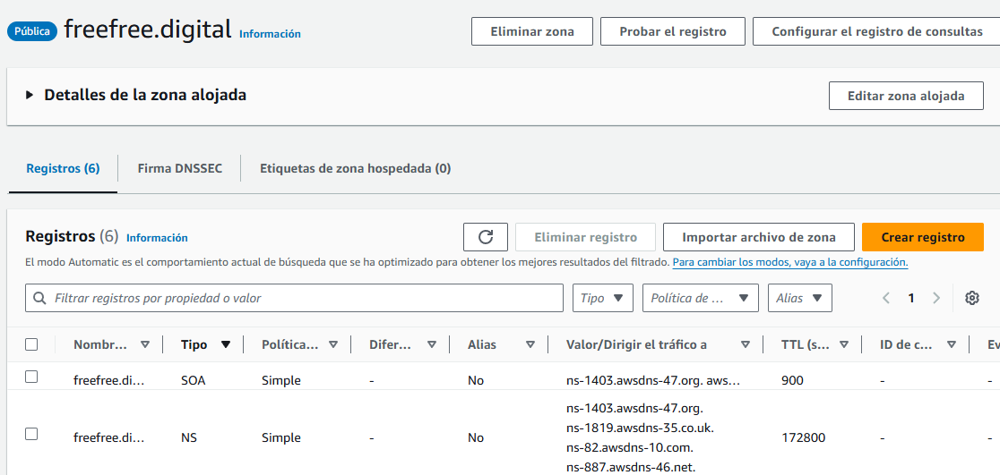
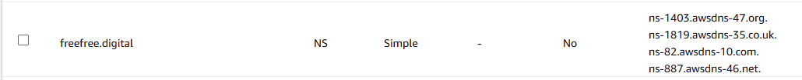

# Configuración de Docker en i-WebServer para Laboratorio de WordPress

## Descripción
Este documento detalla los pasos para configurar Docker y Docker Compose en la instancia `i-WebServer` de AWS en el contexto de un laboratorio para desplegar WordPress con ELB (Elastic Load Balancing) y Auto Scaling.

## Requisitos previos
1. Completar los pasos del laboratorio descritos en "PDF-Laboratorio-Wordpress-ELB-AutoScaling" hasta el punto 7.3.
2. Acceso a una instancia `i-WebServer` mediante un `BastionHost`.
3. Credenciales de conexión (archivo `.pem` o configuraciones de SSH necesarias).

## Pasos a seguir

### 1. Conectar a la instancia `i-WebServer`
Conéctate primero al `BastionHost` y luego a la instancia `i-WebServer` desde allí. Usa el siguiente comando, reemplazando `ruta_a_tu_archivo.pem`, `usuario`, `IP_BastionHost` e `IP_i-WebServer` con la información adecuada:

```bash
# Conectar al BastionHost
ssh -i "ruta_a_tu_archivo.pem" usuario@IP_BastionHost

# Desde el BastionHost, conectar a la instancia i-WebServer
ssh usuario@IP_i-WebServer
```

### 2. Actualizar y configurar Docker en i-WebServer


```bash
 # Actualizar los repositorios
sudo apt update

# Instalar dependencias necesarias
sudo apt install -y apt-transport-https ca-certificates curl software-properties-common

# Agregar la clave GPG oficial de Docker
curl -fsSL https://download.docker.com/linux/ubuntu/gpg | sudo gpg --dearmor -o /usr/share/keyrings/docker-archive-keyring.gpg

# Agregar el repositorio de Docker
echo "deb [arch=$(dpkg --print-architecture) signed-by=/usr/share/keyrings/docker-archive-keyring.gpg] https://download.docker.com/linux/ubuntu $(lsb_release -cs) stable" | sudo tee /etc/apt/sources.list.d/docker.list > /dev/null

# Actualizar la lista de paquetes
sudo apt update

# Instalar Docker
sudo apt install -y docker-ce docker-ce-cli containerd.io

# Instalar Docker Compose
sudo apt install -y docker-compose

# Añadir tu usuario al grupo docker para no tener que usar sudo
sudo usermod -aG docker $USER

# Cerrar la sesión y volver a entrar para aplicar los cambios de grupo
exit
ssh usuario@IP_i-WebServer  # Reingresa a la instancia

# Verificar que Docker y Docker Compose están instalados correctamente
docker --version
docker-compose --version
```
Después de ejecutar estos comandos, es recomendable que cierres sesión y vuelvas a iniciar sesión para que los cambios en los grupos surtan efecto. 

### 3 Creamos una nueva directorio para el proyecto
```bash
mkdir wordpress-docker
cd wordpress-docker
```
### 4. Creamos tres archivos con los siguientes datos
a) docker-compose.yml
```bash
# docker-compose.yml
version: '3'

services:
  wordpress:
    build: .
    ports:
      - "80:80"
    volumes:
      - ./wordpress:/var/www/html
      - ./php.ini:/usr/local/etc/php/conf.d/php.ini
    environment:
      WORDPRESS_DB_HOST: 172.16.3.196
      WORDPRESS_DB_NAME: wordpress
      WORDPRESS_DB_USER: wpuser
      WORDPRESS_DB_PASSWORD: wppassword
    restart: always
    healthcheck:
      test: ["CMD", "curl", "-f", "http://localhost/health.html"]
      interval: 30s
      timeout: 10s
      retries: 3
```
2. Dockerfile
```bash
FROM wordpress:php8.1-apache

# Evitar interacción durante la instalación de paquetes
ENV DEBIAN_FRONTEND=noninteractive

# Instalar extensiones PHP y dependencias necesarias
RUN apt-get update && apt-get install -y \
    libfreetype6-dev \
    libjpeg62-turbo-dev \
    libpng-dev \
    libzip-dev \
    libxml2-dev \
    libssl-dev \
    libicu-dev \
    && rm -rf /var/lib/apt/lists/* \
    && docker-php-ext-configure gd --with-freetype --with-jpeg \
    && docker-php-ext-install -j$(nproc) \
        gd \
        mysqli \
        zip \
        soap \
        intl

# Habilitar mod_rewrite
RUN a2enmod rewrite

# Copiar configuración personalizada de PHP
COPY php.ini /usr/local/etc/php/conf.d/php.ini

# Copiar archivo de salud
COPY health.html /var/www/html/health.html

# Configurar permisos
RUN chown -R www-data:www-data /var/www/html && \
    find /var/www/html/ -type d -exec chmod 750 {} \; && \
    find /var/www/html/ -type f -exec chmod 640 {} \;
```
3. php.ini

```bash
# php.ini
upload_max_filesize = 64M
post_max_size = 64M
max_execution_time = 300
max_input_time = 300
memory_limit = 256M
```

estos tres archivos en el mismo directorio `wordpress-docker` que fue el nombre que asignamos
### 5. Creamos un archivo health.html:

```bash
touch health.html
```
### 6. Descargamos wordpress:

```bash
curl -O https://wordpress.org/latest.tar.gz
tar xzvf latest.tar.gz
mv wordpress html
```

### 7. Creamos el archivo wp-config.php:

```bash
cp html/wp-config-sample.php html/wp-config.php
```
### 8. Modificamos el wp-config.php con tus credenciales de base de datos:

```bash
sed -i 's/database_name_here/wordpress/' html/wp-config.php
sed -i 's/username_here/wpuser/' html/wp-config.php
sed -i 's/password_here/wppassword/' html/wp-config.php
sed -i 's/localhost/172.16.3.196/' html/wp-config.php
```


### 9. iniciamos los contenedores y verificamos que todo funciona:

```bash
docker-compose up -d --build
```
verficacion:
```bash
docker ps
curl localhost/health.html
```
### 10. Modificar directamente desde el contenedor el wp-config.php para https:


```bash
# Entrar al contenedor
docker exec -it wordpress-docker_wordpress_1 bash

# Editar wp-config.php
vi /var/www/html/wp-config.php
```

Agregamos la configuracion para https:

```bash
/* Configuración SSL */
define('FORCE_SSL_ADMIN', true);
if (strpos($_SERVER['HTTP_X_FORWARDED_PROTO'], 'https') !== false)
    $_SERVER['HTTPS']='on';

/* Define el dominio del sitio */
define('WP_HOME','https://www.freefree.digital');
define('WP_SITEURL','https://www.freefree.digital');

/* Forzar HTTPS en WordPress */
define('FORCE_SSL_ADMIN', true);
define('FORCE_SSL_LOGIN', true);
```

despues de modificar el archivo, bajamos el contendor y lo volvemos a subir para reconstruirlo:

```bash
docker-compose down
docker-compose up -d
```

### 11. Seguimos los pasos 8.1 y 8.2 del laboratorio "PDF-Laboratorio-Wordpress-ELB-AutoScaling"


### 12. Confifurar dominio y generar certificados SSL/TLS

12.1 Nos dirigimos a Route 53 de AWS y creamos una zona alojada, en nombre de dominio colocamos el nombre de nuestro dominio, agregamos una descripción (opcional) y seleccionamos zona alojada publica y creamos pulsamos "crear zona"

debe aparecer algo mas o menos así:


12.2 nos dirigimos a nuestro server de dominio, en mi caso godaddy y en configuraciones dns, cambiamos los servidores de valores de tipo ns que nos da el route 53
en mi caso, estos:


12.3 Buscamos la herramienta de AWS de Certificate Manager y pulsamos en solicitar, agregamos el nombre del dominio en mi caso `freefree.digital` y `www.freefree.digital`, en metodo de validación, seleccionamos `Validacion por DNS` y seleccionamos como algoritmo clave `RSA 2048` pulsamos solicitar y esperamos a que nos aparezca el certificado sin validar, una vez validado simplemete pusamos en crear registros en Route 53 y seleccionamos nuestro dominio configurado, crear. esperamos unos momentos que actualice y nos dará la certificacion emitida.

### 13. Creamos un Balanceador de Cargas 
Ahora se procede a configurar el balanceador de carga. En el menú de EC2, por favor localice la opción de 
‘Load Balancers’. Click en “Create load balancer”. Seleccione la opción de ‘Application Load Balancer (ALB)’

Basic Configuration. 
• Load Balancer Name: lb-WebCMS 
• Scheme: Internet Facing. 

Network Mappings 
• VPC: CMS-vpc 
• Mappings: Aquí se debe seleccionar las dos zonas de disponibilidad que definimos en nuestra 
arquitectura.   
o Marque la casilla para la AZ1 (us-east-1a). 
§ Seleccione la subred pública de esta AZ. (CMS-subnet-public1-us-east-1a) 
o Marque la casilla para la AZ2 (us-east-1b) 
§ Seleccione la subred pública de esta AZ. (CMS-subnet-public2-us-east-1b)
Security Groups: En caso tal aparezca un security group seleccionado, elimínelo.  
o Ahora se procede a crear un nuevo security group (SG-LB). Se debe crear con una regla 
que permita el ingreso de tráfico http al puerto 80 y https al puerto 443 desde cualquier dirección IPv4 e IPv6 
(Anywhere). 
o Una vez creado el security group, selecciónelo. 

Listeners and Routing: 
• Listener:  
o Protocol: HTTPs
o Port:443
o Forward to: En esta sección, se debe crear o seleccionar un target group.  
§ Seleccione el target group creado en el punto 8.2. del laboratorio En caso tal no 
aparezca, de click en refresh. Si no aparece, seleccione la opción crear uno y 
ejecute los pasos del punto 8.2. 
o en configuracion del  agente que escucha seguro seleccionamos en nombre de la politica el recomendado
y en certificados de servidor SSL/TLS en el origen del certificado  De ACM, seleccionamos el certificado que escogimos el certificado que previamente emitimos 
• Click en “create load balancer”. 
una vez creado, verificamos que aparezca activo y pulsamos en agregar agente que escucha, en la configuracion seleccionamos http puerto 80 y abajo seleccionamos redirigir a la URL y seleccionamos HTTPS en el puerto 443 y agregar


### 14. Apuntamos en Route 53 con registro tipo A con alias hacia el balanceador de carga
debe quedar de la siguiente manera:

pulsamos crear registros y esperamos un momento que actualice

### 15. una vez implementado todo eso, se sigue a partir de los pasos 9 del laboratorio y finalmente busca la pagína con el dominio en el buscador.


```bash

``` 